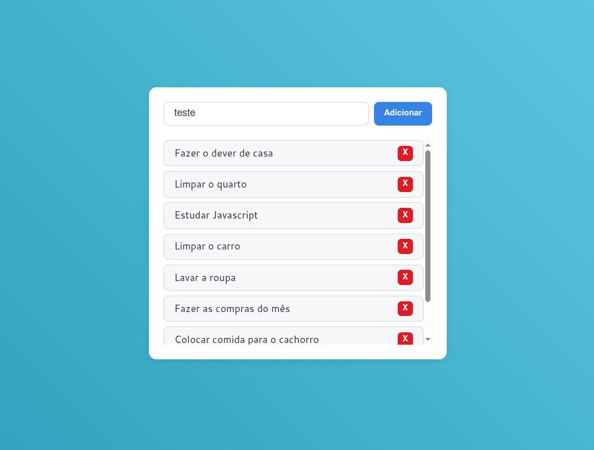

  
  
  
  

## Conteúdo

- [Conteúdo](#conteúdo)
- [Introdução](#introdução)
- [Demonstração](#demonstração)
- [Aprendizados](#aprendizados)
- [Licença](#licença)

## Introdução

Uma aplicação interativa de **lista de tarefas**, desenvolvida com **HTML**, **CSS** e **JavaScript**, onde o usuário pode **adicionar**, **marcar como concluída** ou **excluir** tarefas. O foco deste projeto foi reforçar os fundamentos da manipulação do **DOM**, **arrays** e **eventos** em JavaScript, aplicando boas práticas e organização de código.

## Demonstração

  

> Interface da lista de tarefas.

## Aprendizados

- **Manipulação de Arrays:**
  - Utilização do método `splice()` para remover itens específicos do array de tarefas.
  - Uso do `push()` para adicionar novos elementos.
- **Renderização dinâmica:**
  - Recriação da lista no DOM a cada alteração garantindo que a interface fique sempre sincronizada com o array de `tasks`.
- **Validação e feedback visual:**
  - Implementação de mensagens de **erro** e estado **vazio** para melhorar a experiência do usuário.
- **Separação de responsabilidades:**
  - Uso de funções pequenas e específicas para manter o código limpo e organizado.
- **Utilização de Eventos:**
  - Utilização de eventos como `submit` e `DOMContentLoaded` para interações.
- **Variáveis CSS:**
  - Adiciona variáveis css para `textos`, `cores` e outros.

## Licença

Este projeto está sob a licença **MIT**, você é livre para **usar, modificar e distribuir** este código, desde que mantenha os créditos originais, consulte o arquivo [LICENSE](./LICENSE) para mais informações.
